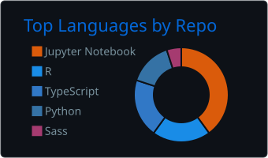
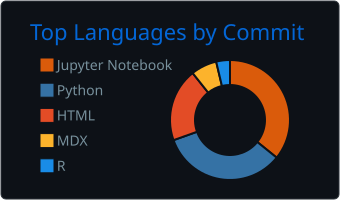
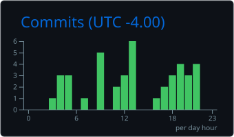

# Jawad Alaoui

Data & AI engineering · production systems · cloud architecture

[jawad.dev](https://jawad.dev/) · [LinkedIn](https://www.linkedin.com/in/jawadalaoui/)

## Engineering activity

## Languages and contribution patterns

 

Generated daily from authenticated GitHub data by [User Statistician](https://github.com/cicirello/user-statistician), [GitHub Profile Summary Cards](https://github.com/vn7n24fzkq/github-profile-summary-cards), and [Lowlighter Metrics](https://github.com/lowlighter/metrics). The [generation workflow](.github/workflows/user-stats.yml) is public. Private activity is included only in aggregate; private repository names and contents are not published.

## Google Cloud professional certifications

- [Professional Cloud Architect](https://jawad.dev/certifications/google-cloud-professional-cloud-architect-jawad-alaoui.pdf) — issued March 15, 2026; valid through March 15, 2028.
- [Professional Data Engineer](https://jawad.dev/certifications/google-cloud-professional-data-engineer-jawad-alaoui.pdf) — earned August 7, 2024.
