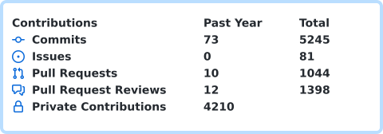

# Jawad Alaoui

Data & AI engineering · production systems · cloud architecture

[jawad.dev](https://jawad.dev/) · [LinkedIn](https://www.linkedin.com/in/jawadalaoui/)

## GitHub activity

Generated daily from authenticated GitHub data by [User Statistician](https://github.com/cicirello/user-statistician) and [Lowlighter Metrics](https://github.com/lowlighter/metrics). Private activity is included only in aggregate; private repository names and contents are not published.

## Google Cloud professional certifications

- [Professional Cloud Architect](https://jawad.dev/certifications/google-cloud-professional-cloud-architect-jawad-alaoui.pdf) — issued March 15, 2026; valid through March 15, 2028.
- [Professional Data Engineer](https://jawad.dev/certifications/google-cloud-professional-data-engineer-jawad-alaoui.pdf) — earned August 7, 2024.
